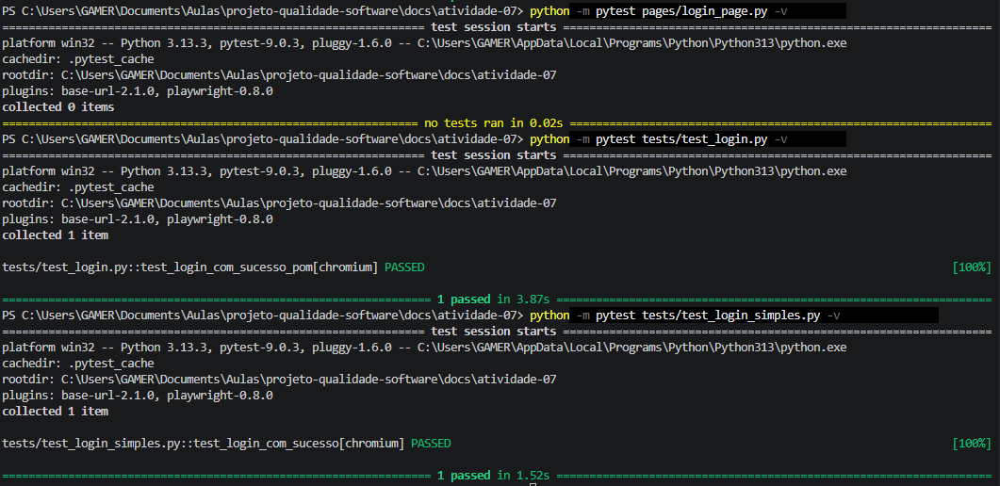

# Atividade PBL – Aula 10: Testes Funcionais Automatizados e E2E – LocalEats

**Integrante:** Patric Morales Taborda

**Contexto:** Evolução da abordagem de QA do sistema LocalEats, passando de testes isolados para a automação de testes funcionais completos (E2E) utilizando Playwright e Pytest com arquitetura POM.

---

## 🔹 1. Fluxo funcional escolhido

**🔐 1. Login de usuário**

* **O que faz:** Permite autenticar um usuário no sistema LocalEats.
* **Problema que resolve:** Garante o acesso seguro às funcionalidades privadas do sistema.
* **Importância:** É o fluxo crítico de entrada. Se o login falhar, o usuário não consegue consumir o serviço.
* **Cenários esperados:**
    * Login com credenciais válidas -> Redirecionamento com sucesso.
    * Login com credenciais inválidas -> Exibição de mensagem de erro amigável.
    * Tentativa de login com campos vazios -> Validação em tela.

---

## 🔹 2. Teste automatizado com Codegen

O código inicial foi gerado através do comando `playwright codegen https://local-eats-unisenac.vercel.app/`.

**Código bruto gerado (trecho analisado):**

```python
    page.goto("[https://local-eats-unisenac.vercel.app/static/login.html](https://local-eats-unisenac.vercel.app/static/login.html)")
    page.locator("#loginForm").get_by_role("button", name="Entrar").click()
    page.get_by_role("textbox", name="teste@teste.com").click()
    page.get_by_role("button", name="Entrar").click()
    page.get_by_role("textbox", name="teste@teste.com").dblclick()
    page.get_by_text("E-mail Senha Entrar").click()
    page.locator("#loginForm").get_by_text("Senha").click()
    page.get_by_role("textbox", name="Sua senha secreta").click()
```

**Análise do Codegen:**
* **O que fez bem:** Mapeou o link direto da página de login (`/static/login.html`) e identificou os seletores reais usados no formulário, como `name="teste@teste.com"`.
* **O que gerou de desnecessário/frágil:** O código gravou diversas ações inúteis causadas por movimentos normais do mouse, como cliques duplos (`dblclick()`) e cliques em textos da interface. Foi necessário limpar isso e trocar os `.click()` acidentais em campos de texto por comandos `.fill()`.

---

## 🔹 3. Implementação do teste com Pytest (Primeira Versão)

Antes da arquitetura final, o teste foi limpo e transformado em um teste funcional executável, removendo a sujeira do gravador.

**Arquivo: `tests/test_login_simples.py`**

```python
import pytest
from playwright.sync_api import Page, expect

def test_login_com_sucesso(page: Page):
    # 1. Acesso direto
    page.goto("[https://local-eats-unisenac.vercel.app/static/login.html](https://local-eats-unisenac.vercel.app/static/login.html)")
    
    # 2. Interação baseada nos seletores mapeados pelo Codegen
    page.get_by_role("textbox", name="teste@teste.com").fill("teste@email.com")
    page.get_by_role("textbox", name="Sua senha secreta").fill("123456")
    
    # 3. Confirmação ligada estritamente ao formulário de login
    page.locator("#loginForm").get_by_role("button", name="Entrar").click()

    # 4. Validação (Assertion)
    expect(page.get_by_text("Bem-vindo")).to_be_visible()
```

---

## 🔹 4. Refatoração com Page Object Model (POM)

Para garantir que o código seja legível e fácil de manter, o fluxo foi refatorado utilizando o padrão Page Object Model.

**Arquivo: `pages/login_page.py`**

```python
class LoginPage:
    def __init__(self, page):
        self.page = page
        # Mapeamento de elementos (Locators)
        self.input_email = page.get_by_role("textbox", name="teste@teste.com")
        self.input_senha = page.get_by_role("textbox", name="Sua senha secreta")
        self.botao_entrar = page.locator("#loginForm").get_by_role("button", name="Entrar")
        self.mensagem_boas_vindas = page.get_by_text("Bem-vindo")

    def acessar(self):
        self.page.goto("[https://local-eats-unisenac.vercel.app/static/login.html](https://local-eats-unisenac.vercel.app/static/login.html)")

    def realizar_login(self, email, senha):
        self.input_email.fill(email)
        self.input_senha.fill(senha)
        self.botao_entrar.click()

    def verificar_sucesso(self):
        return self.mensagem_boas_vindas
```

**Arquivo: `tests/test_login.py`**

```python
from pages.login_page import LoginPage
from playwright.sync_api import expect

def test_login_com_sucesso_pom(page):
    # Setup
    login_page = LoginPage(page)
    
    # Execução
    login_page.acessar()
    login_page.realizar_login("teste@email.com", "123456")

    # Asserção
    expect(login_page.verificar_sucesso()).to_be_visible()
```

---

## 🔹 5. Execução dos testes

* **Total de testes:** 2
* **Quantos passaram:** 2
* **Quantos falharam:** 0

**Evidência de execução (Terminal):**


---

## 🔹 6. Análise crítica dos testes

* **O teste quebrou em algum momento? Por quê?** Sim. Na primeira tentativa, ao buscar um botão rígido chamado "Login" usando o seletor `get_by_role`, o Playwright deu erro de *Timeout*. Isso aconteceu porque a interface real não possuía esse elemento, exigindo que eu analisasse o código do Codegen para encontrar a URL `/static/login.html` e os nomes corretos dos campos.
* **Quais seletores foram mais difíceis?** Entender que os campos de texto usavam o *placeholder* ("teste@teste.com") como atributo de acessibilidade no front-end.
* **O Codegen ajudou ou gerou problemas?** O Codegen foi fundamental para mapear os seletores reais ("Sua senha secreta", formulário "#loginForm"), mas a gravação bruta trouxe inúmeros cliques duplos em locais vazios. O código final exige limpeza humana.
* **O teste é confiável? Por quê?** Sim, a versão refatorada usa seletores por Papel (`role`) e ID único, ignorando estruturas frágeis de CSS (como `div > div > button`).
* **O que tornaria o teste mais robusto?** A implementação de seletores `data-testid` dedicados à automação no front-end do LocalEats.
* **Quais são os riscos de manutenção?** Alterações no *placeholder* dos campos (ex: mudar "teste@teste.com" para "Digite seu e-mail") quebrarão o teste. O POM isola esse risco no arquivo `login_page.py`.

---

## 🔹 7. Reflexão no contexto do LocalEats

* **Testes automatizados substituem testes manuais?** Não. Eles apenas executam fluxos conhecidos repetidamente para evitar regressão. Testes manuais continuam vitais para usabilidade.
* **Vale a pena automatizar todos os fluxos?** Não, o foco deve estar nos fluxos críticos do negócio (Login e Pedidos) devido ao custo de manutenção.
* **Como isso ajuda no projeto do grupo?** Valida os deploys do LocalEats instantaneamente. Saberemos na mesma hora se uma alteração no código quebrou o acesso dos usuários.