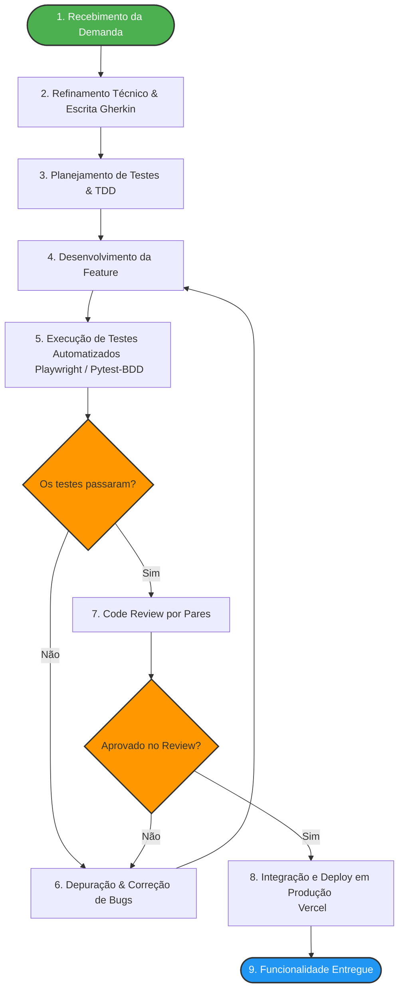

# Atividade PBL – Aula 14: Qualidade de Processo – LocalEats

**Integrante:** Patric Morales Taborda

---

## 🔹 1. Mapeamento do Processo Atual

O fluxo abaixo descreve a sequência de atividades realizadas desde o surgimento de uma nova necessidade de negócio até a sua disponibilização em produção no ambiente do LocalEats. O mapeamento destaca os pontos de decisão e o ciclo de feedback entre desenvolvimento e qualidade.

---

## 🔹 2. Identificação de Entradas, Atividades e Saídas

Com base no fluxo mapeado acima, a tabela abaixo detalha as interações de cada etapa do processo, discriminando os insumos necessários (Entradas), o trabalho executado (Atividades) e os artefatos gerados (Saídas).

| Etapa | Entrada (Inputs) | Atividade (Processamento) | Saída (Outputs) |
| :--- | :--- | :--- | :--- |
| **1. Refinamento de Requisitos** | Histórias de usuário brutas e solicitações de novas features para o LocalEats. | Reunião de alinhamento para entender os objetivos de negócio e traduzir os critérios de aceitação no formato Gherkin (BDD). | Arquivos `.feature` documentados com cenários ubíquos (`Given/When/Then`). |
| **2. Desenvolvimento (TDD/Feature)** | Arquivos `.feature` validados e o código-fonte da branch base (`main`). | Escrita prévia de testes unitários (quando aplicável) e implementação técnica da funcionalidade nas páginas HTML/JavaScript. | Código-fonte da funcionalidade implementado e funcional. |
| **3. Automação e Validação (QA)** | Código desenvolvido, cenários BDD e scripts base de teste. | Mapeamento de seletores de interface via Codegen/Playwright e execução local da suite de testes automatizados via `pytest`. | Relatório de execução dos testes com status (`PASSED` / `FAILED`) e logs de execução. |
| **4. Revisão de Código (Code Review)** | Pull Request (PR) aberto no GitHub contendo o código e a evidência de sucesso dos testes. | Avaliação estática realizada por outro integrante da equipe, checando padrões de arquitetura, legibilidade e cobertura de testes. | Pull Request aprovado e branch mesclada (Merged) no repositório. |
| **5. Homologação e Entrega (Deploy)** | Código integrado na branch principal estável (`main`). | Execução automatizada do pipeline de *build* e publicação na plataforma de hospedagem em nuvem (Vercel). | Sistema LocalEats atualizado e disponível publicamente na URL de produção. |

---

## 🔹 3. Reflexão sobre o Processo

### O processo utilizado pela equipe está claramente definido?
Sim. A transição de um modelo de desenvolvimento puramente técnico para um fluxo guiado por comportamento (BDD) ajudou a delimitar o início e o fim de cada tarefa. Ao estabelecer barreiras de qualidade (como a obrigatoriedade de cenários válidos antes da codificação), o processo deixou de ser intuitivo e passou a ser padronizado, reduzindo a ambiguidade.

### Todos os integrantes seguem o mesmo fluxo de trabalho?
Sim, pois o fluxo está diretamente atrelado ao ciclo de vida da ferramenta de versionamento (Git). Um integrante não consegue integrar um código diretamente na branch principal sem passar pelas etapas obrigatórias de validação dos seletores, execução local do runner do pytest e submissão ao code review, o que força a conformidade de toda a equipe.

### Em quais etapas a qualidade é verificada?
A qualidade é verificada de forma contínua através do conceito de *Shift-Left Testing* (testar desde o início):
1. **Nav concepção:** Quando os critérios de aceitação são blindados através da sintaxe Gherkin.
2. **No desenvolvimento:** Durante a escrita de funções limpas e validação de seletores robustos.
3. **Na pré-entrega:** Com a execução automatizada do Playwright para certificar que comportamentos antigos não sofreram regressão e que os novos fluxos estão íntegros.
4. **Na revisão:** Pelo crivo humano no Code Review.

### Quais melhorias poderiam tornar o processo mais eficiente?
Uma melhoria imediata de extrema eficiência seria a implementação de um pipeline de **CI/CD (Integração Contínua)** utilizando GitHub Actions. Atualmente, a execução da automação depende do acionamento manual do comando `python -m pytest` no terminal do desenvolvedor. Automatizar esse gatilho diretamente no GitHub impediria o Merge de qualquer Pull Request caso algum cenário falhasse, eliminando o fator de esquecimento humano.

### Como a qualidade do processo impacta a qualidade do produto final?
A qualidade do produto final é um reflexo direto da maturidade do processo. Quando um processo é desorganizado, defeitos simples chegam até o usuário final, gerando retrabalho massivo para o desenvolvedor e frustração para o cliente. Um processo estruturado garante previsibilidade: diminui o tempo gasto corrigindo bugs repetitivos, otimiza a comunicação do time e garante que o LocalEats entregue valor de forma estável, segura e escalável a cada deploy na Vercel.